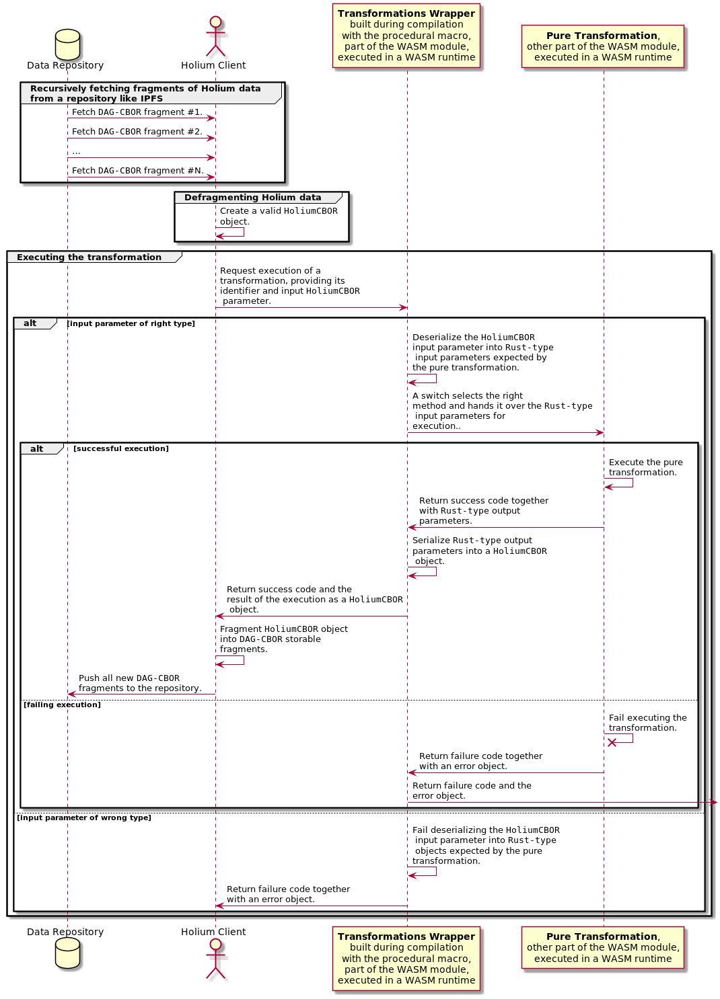

# Specifications

**entry points** will have the same name as the exported **pure transformation** they will lead to.

When passing data from the **host** to the **guest**, Wasm is currently limited. To bypass that limit we 
directly interact with the guest's **linear memory**. By using pointers and lengths we are able
to read and write complex data from and to our **module**.

Here is an overview of a given execution:

All **wrapped transformations** must have the same signature:

`fn (ret_ptr: u32, input_ptr: u32, input_len: u32) -> ()`

All pointers and lengths refer to pointers and lengths of data on the **linear memory** of our **guest**.

`ret_ptr` contains data in a tuple of format `(u32, u32)` being the pointer and length of HoliumCBOR 
return payload.

`input_ptr` and `input_len` are the pointer and length of the input payload in HoliumCBOR format that
should be used to run the transformation.
